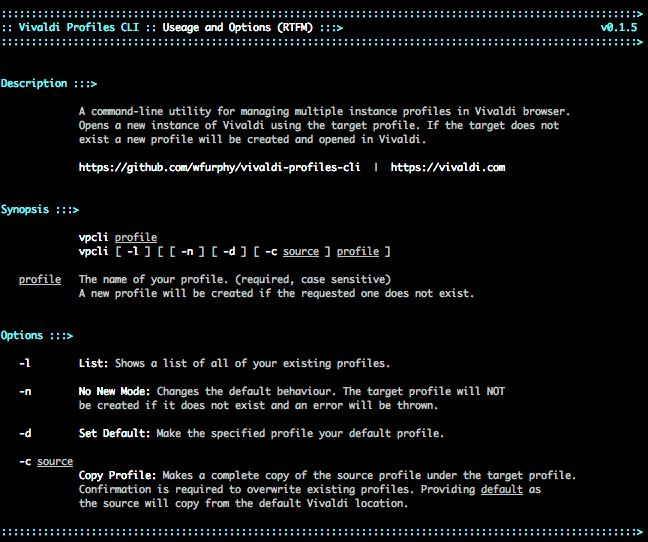

# Vivaldi Profile CLI

#### Warning: This is in beta. Please backup your profiles!
##### Documentation still under development, sorry!

Vivaldi Profile CLI is a command-line utility for managing multiple instance profiles in [Vivaldi]('https://vivaldi.com') browser. Think of it like the multiple profile switcher in Chrome.  

By specifying a name you can open a new instance of Vivaldi using that profile. It will even create the profile for you if it doesn't exist. You can also copy settings from another profile and change which profile is opened as default.

So, now that you have Vivaldi Profile CLI, you can uninstall Chrome! ;)

## Getting Started

These instructions will get you a copy of the project up and running on your local machine for development and testing purposes. See deployment for notes on how to deploy the project on a live system.

### Prerequisites

* OS X, MacOS or Linux with bash
* [Vivaldi]('https://vivaldi.com') Web Browser

### Installation

[Download](https://www.google.com.au/url?sa=t&rct=j&q=&esrc=s&source=web&cd=1&cad=rja&uact=8&ved=0ahUKEwjKtf6m89XXAhUIkZQKHYCuBVYQFggmMAA&url=https%3A%2F%2Fvivaldi.com%2Fdownload%2F%3Flang%3Den&usg=AOvVaw1b7SMyM9QJfW0t_REb_z9R) and Install Vivialdi if you don't have it yet.

### Install via curl

#### Copy and paste this entire block in terminal
```bash
curl -O https://cdn.rawgit.com/wfurphy/vivaldi-profiles-cli/master/vpcli.sh && 
  chmod 755 vpcli.sh &&  
  mv vpcli.sh /usr/local/bin/vpcli &&
  vpcli
  
```

#### OR One step at a time

1. Download
```bash
curl https://cdn.rawgit.com/wfurphy/vivaldi-profiles-cli/master/vpcli.sh
```


2. Add execute (x) permissions 
```bash
chmod 755 vpcli.sh
```


3. Give it a keyboard friendly name like `vpcli` when you move it to /usr/local/bin
```bash
mv vpcli.sh /usr/local/bin/vpcli
```

4. Test
```bash
vpcli
```

You should see this:




### You should see the help screen:

If you have `vpcli` in your `/usr/local/bin` directory and are still not able to access the command please make sure you have followed the previous steps coorectly. If you're still having trouble then please ensure you are loading the updated PATH by sourcing .profile (macOS)
```bash
source ~/.profile
```
 or .bashrc (anywhere respectable).
```bash
source ~/.bashrc
```

## Versioning

We use [SemVer](http://semver.org/) 

## Authors
Will Furphy - [Technique](https://technique.software)

## License

This project is licensed under the MIT License - see the [LICENSE](wpcli.sh) at the top of the file for details

## Acknowledgments

* Hat tip to Russell Brenner for introducing me to Vivaldi.
